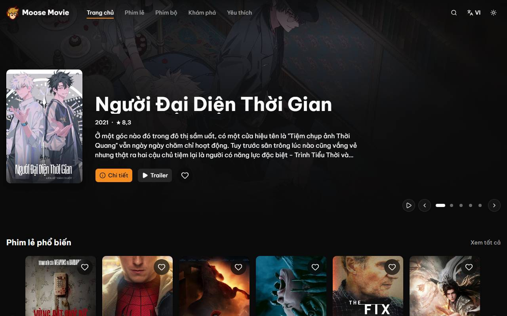
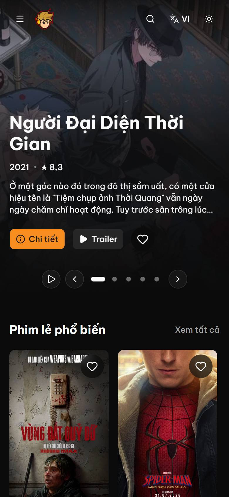
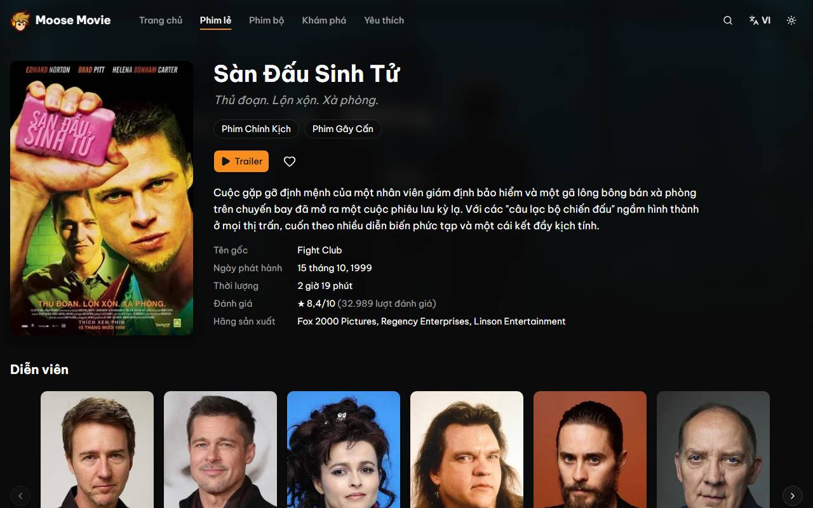
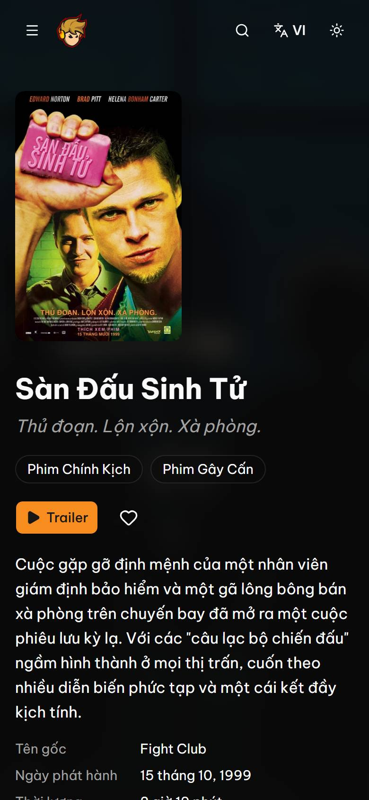
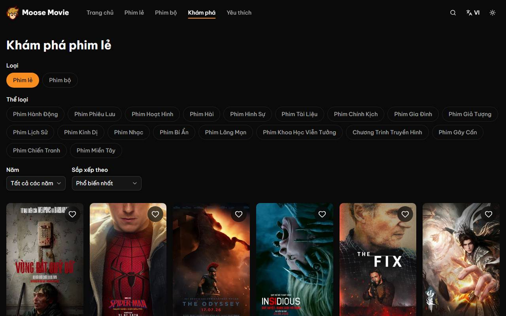
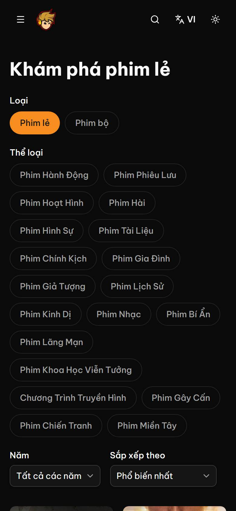
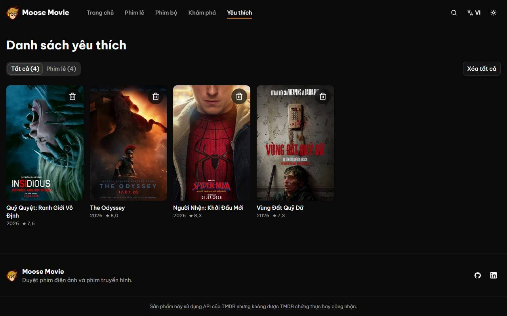
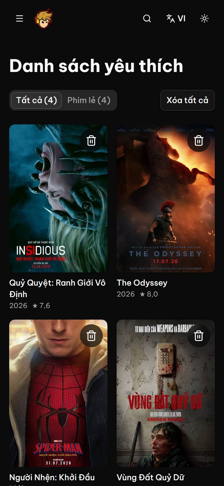

# Moose Movie

[](https://github.com/MooseNguyen/ui-moose-movie-web-2/actions/workflows/ci.yml)

Moose Movie is a bilingual (Vietnamese / English) movie and TV browsing app
built on [TMDB](https://www.themoviedb.org) data. It is a portfolio rebuild of
an older Create React App project with Next.js 16. Pages are server-rendered or
statically generated for SEO and fast first paint. Client JavaScript is limited
to interactive leaf components. Every change goes through lint, type checks,
unit and component tests, Playwright E2E tests and Lighthouse budgets in CI.

**Live demo:** TBD after Vercel deploy

## Features

- **Home:** trending hero slider with trailers, plus six carousels (popular,
  top rated and upcoming movies; popular, top rated and on-the-air TV).
- **Lists:** movie and TV lists with "Load more" pagination through Server
  Actions.
- **Search:** search across movies, TV and people. Vietnamese diacritics and
  special characters survive the round trip through the URL.
- **Discover:** filter by type, genre and year, and sort the results. Filters
  live in the URL, so they can be shared and survive a reload.
- **Detail pages** for movies and TV: cast, trailers that load on click,
  related titles, and an English fallback when the Vietnamese overview is empty.
- **Person pages:** biography and filmography.
- **Favorites:** stored in `localStorage`, with tabs, "clear all" and undo.
- **Languages:** `vi` (default) and `en`. Switching keeps the current page.
- **Theme:** dark by default with a light theme. The page never flashes the
  wrong colors on load.
- **SEO:** canonical URLs, hreflang, sitemap, robots, Open Graph and JSON-LD
  (`Movie` / `TVSeries`).
- **Accessibility:** works with the keyboard alone, shows a visible focus ring,
  meets AA contrast in both themes, and announces "Load more" results through
  live regions.

## Screenshots

| Desktop                                                                                         | Mobile                                                                                        |
| ----------------------------------------------------------------------------------------------- | --------------------------------------------------------------------------------------------- |
|                    |             |
|       |         |
|  |  |
|                 |   |

To regenerate them, run `pnpm screenshots`. It builds the app, starts it on
port 3100 and writes JPEGs to `docs/screenshots/`.

## Tech stack

| Layer         | Technology                                               | Why                                                                                 |
| ------------- | -------------------------------------------------------- | ----------------------------------------------------------------------------------- |
| Framework     | Next.js 16 (App Router, Turbopack)                       | SSR/ISR for SEO and fast first paint; replaces the old CRA app                      |
| UI runtime    | React 19                                                 | Server Components, Server Actions, `useTransition`                                  |
| Language      | TypeScript (strict)                                      | Catches TMDB data-shape mistakes while coding                                       |
| Styling       | Tailwind CSS v4                                          | No runtime; the CSS contains only the classes in use                                |
| Components    | shadcn/ui (Radix)                                        | Accessibility built in, and the code lives in the repo                              |
| Theme         | In-house module (inline script + `useSyncExternalStore`) | Dark by default without a color flash; replaced the unmaintained next-themes        |
| Carousel      | Embla Carousel (+ Autoplay)                              | Small (~7 KB); the carousel shadcn/ui officially uses                               |
| i18n          | next-intl                                                | Works with Server Components, `/[locale]` routes and hreflang                       |
| Validation    | Zod v4                                                   | Validates TMDB responses, env, URL params and Server Action input                   |
| Client state  | Zustand + `persist`                                      | Favorites in ~1 KB                                                                  |
| Testing       | Vitest, Testing Library, MSW, Playwright                 | Fast unit and component tests with mocked HTTP; E2E against a real production build |
| Quality gates | ESLint, Prettier, Lighthouse CI                          | Consistent code and enforced performance, accessibility and SEO budgets             |
| Deploy / CI   | Vercel, GitHub Actions, Dependabot                       | Preview deploy per PR, checks on every push, weekly dependency updates              |

## Getting started

Requirements: Node.js ≥ 20.9. pnpm is pinned through `packageManager` in
`package.json`, so Corepack provides the right version.

```bash
corepack enable
pnpm install
cp .env.example .env.local
```

Then fill in `.env.local`:

| Variable               | Required      | Description                                                                                                                                             |
| ---------------------- | ------------- | ------------------------------------------------------------------------------------------------------------------------------------------------------- |
| `TMDB_READ_TOKEN`      | yes           | TMDB **API Read Access Token** (v4 bearer token). It stays on the server and is never `NEXT_PUBLIC_`.                                                   |
| `NEXT_PUBLIC_SITE_URL` | in production | Absolute origin used for canonical, hreflang and sitemap URLs. Defaults to `http://localhost:3000` locally; a Vercel production build fails without it. |

To get a token:

1. Create a free account at [themoviedb.org](https://www.themoviedb.org/signup).
2. Open **Settings → API** and request an API key (developer, personal use).
3. Copy the **API Read Access Token** (the long JWT), not the short v3 "API
   Key".

`pnpm build` checks both variables first. A missing token, an invalid site
URL, or (on a Vercel production deploy) a missing site URL stops the build
with a clear message instead of producing pages full of TMDB errors or
localhost canonicals. `pnpm typecheck` does not need the token.

```bash
pnpm dev   # http://localhost:3000
```

> **TMDB blocked by your ISP?** Some networks (including some Vietnamese ISPs)
> block or reset connections to `*.themoviedb.org`. If API calls time out
> locally, switch to a public DNS resolver (e.g. 1.1.1.1) or use a VPN such as
> Cloudflare WARP. `image.tmdb.org` is usually reachable either way.

## Scripts

| Script               | What it does                                                             |
| -------------------- | ------------------------------------------------------------------------ |
| `pnpm dev`           | Start the dev server (Turbopack) on port 3000                            |
| `pnpm build`         | Production build (validates env, then prerenders Home from TMDB)         |
| `pnpm start`         | Serve the production build                                               |
| `pnpm lint`          | ESLint (flat config, `next/core-web-vitals` + TypeScript)                |
| `pnpm typecheck`     | Generate route types and run `tsc --noEmit`                              |
| `pnpm test`          | Unit and component tests (Vitest)                                        |
| `pnpm test:coverage` | Tests with V8 coverage (≥ 80% lines for `src/lib` and `src/features`)    |
| `pnpm e2e`           | Playwright E2E tests. Builds the app and serves it on port 3100          |
| `pnpm lhci`          | Lighthouse CI on a production server (port 3200). Run `pnpm build` first |
| `pnpm format`        | Prettier (with the Tailwind class sorter)                                |
| `pnpm screenshots`   | Regenerate the README screenshots                                        |

## Project structure

```text
src/
├── app/            # App Router: [locale] routes, layouts, loading/error states, sitemap, robots
├── components/     # UI: layout (header, nav), media (cards, grids, carousels), detail, person, theme, shadcn/ui
├── features/       # Feature modules with their own state and logic: discover (URL filters), favorites (store)
├── i18n/           # next-intl routing, navigation and request config
├── lib/            # TMDB client and schemas (server-only), Server Actions, env, SEO, image helpers
├── messages/       # vi.json / en.json UI strings
└── proxy.ts        # Locale detection and redirects (Next.js 16 middleware)
tests/
├── e2e/            # Playwright specs
├── fixtures/       # Recorded TMDB responses
└── msw/            # Mock Service Worker handlers for unit tests
```

## Testing strategy

- **Unit and component tests (Vitest + Testing Library + MSW):** cover the TMDB
  client (headers, 404, 429 retry, timeouts), schema normalization with missing
  fields, URL param parsing, the favorites store (including corrupt
  `localStorage`), Server Action input validation, and interactive components
  (load more, search, trailer dialog, filters), including loading, error and
  empty states. Coverage must stay at or above 80% of lines.
- **E2E (Playwright, real TMDB):** run against a production build. They cover
  Home → detail, the trailer dialog, search with "Load more", Discover filters
  that survive a reload, and favorites across reloads and a locale switch.
  Smoke tests check 404 responses and that key pages never scroll
  horizontally. Assertions check structure, never specific movie titles,
  because TMDB data changes daily.
- **Lighthouse CI:** checks `/vi`, `/vi/movie` and `/vi/movie/550` on a
  mobile profile, 3 runs each. Failing any of these fails the `lighthouse` CI
  job:
  accessibility ≥ 0.95, SEO = 1, script transfer ≤ 250 KB. Two targets only
  warn: performance ≥ 0.9 and script ≤ 200 KB. The measured baseline is
  ~240 KB of gzipped JavaScript, ~131 KB of which is the Next.js/React
  framework. Getting below 200 KB is tracked in
  [#46](https://github.com/MooseNguyen/ui-moose-movie-web-2/issues/46). Reports
  are kept as CI artifacts, never on public storage.

## Deployment

The app targets [Vercel](https://vercel.com). Import the repository and set
these environment variables for Production and Preview:

- `TMDB_READ_TOKEN`: the TMDB API Read Access Token.
- `NEXT_PUBLIC_SITE_URL`: the deployment's absolute **https** origin, e.g.
  `https://moose-movie.vercel.app`, with no trailing path. Canonical URLs,
  hreflang and the sitemap are built from it.

GitHub Actions needs the `TMDB_READ_TOKEN` secret for the build, E2E and
Lighthouse jobs. Workflows triggered by Dependabot cannot read Actions
secrets, so add the same token a second time under **Settings → Secrets and
variables → Dependabot**; otherwise every Dependabot PR fails the token
check. Dependabot opens grouped dependency update PRs every Monday.

## Known issues

- **JavaScript budget:** every page ships ~240 KB of gzipped JavaScript
  (Lighthouse warns above 200 KB). Reducing it is tracked in
  [#46](https://github.com/MooseNguyen/ui-moose-movie-web-2/issues/46).
- **Discover title after a client-side filter change:** Next.js can keep the
  title and canonical of the prefetched `/discover` route after a filter
  navigation; the E2E test for it is timing-sensitive. Prioritizing the
  first grid posters (an LCP improvement of ~300 ms on `/vi/movie`) made it
  fail reliably and was reverted. Both are tracked in
  [#47](https://github.com/MooseNguyen/ui-moose-movie-web-2/issues/47).

## Attribution

This product uses the TMDB API but is not endorsed or certified by TMDB.

Movie and TV data and images are provided by
[The Movie Database (TMDB)](https://www.themoviedb.org).
